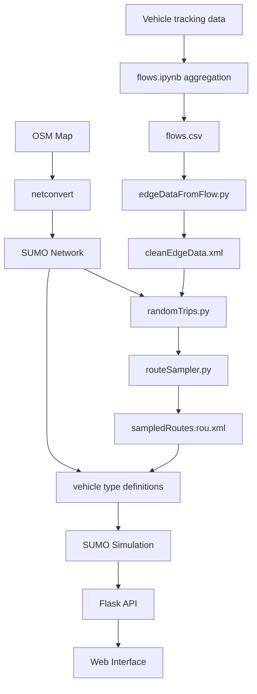

# A5 Proof of Concept

Traffic simulation pipeline built using **SUMO**, **OpenStreetMap**, and real vehicle data.  
Generates calibrated traffic flows, simulates highway behavior, with a web-based interface for scenario testing (tolls, demand scaling, and lane usage).

---

## Overview

This system models traffic on a highway segment (A5) by combining:

- OpenStreetMap road network extraction
- Real vehicle data processing (JSON logs)
- SUMO traffic simulation
- Demand generation using flows
- Web-based simulation control interface

---

## System Architecture




---

## Technologies Used

- Python 3.12
- Flask (backend)
- Jupyter Notebook
- XML processing (ElementTree)
- HTML/JavaScript frontend

---
## Pipeline

### 1. Road Network Creation

Convert OpenStreetMap data into SUMO format:

```bash
netconvert --osm-files A5map.osm -o A5.net.xml
```

Generate polygons:
```bash
polyconvert --osm-files mappol.osm \
  --type-file /usr/share/sumo/data/typemap/osmPolyconvert.typ.xml \
  -o polygons.poly.xml
```
### 2. Traffic Data Processing

Vehicle tracking JSON files are processed in `flows.ipynb`:

- Timestamp sorting
- Speed estimation
- Time bin aggregation (1-second bins)

Output: `flows.csv`

### 3. Convert flows

Convert detector flows into SUMO-compatible demand:

```bash
edgeDataFromFlow.py -f flows.csv -o edgeData.xml
```

Clean XML.

Output: `cleanEdgeData.xml`

### 4. Route Generation

Generate routes:

```bash
randomTrips.py -n A5.net.xml -r randomRoutes.rou.xml
```

Calibrate to real traffic:

```bash
routeSampler.py \
  -r randomRoutes.rou.xml \
  -d cleanEdgeData.xml \
  -o sampledRoutes.rou.xml
```

### 5. Vehicle Behavior Modeling

Vehicles are assigned heterogeneous behavior, by adding <vTypeDistributionid="typedist1"> information to the route file.

### 6. Simulation

Simulation inputs:

- Network: A5.net.xml
- Routes: vehicleRoutes.rou.xml
- Polygons: polygons.poly.xml

Outputs:
- no. vehicles
- lane usage
- speeds
- toll revenue

---
## Web Interface

Features
- Adjust toll pricing (€)
- Set % of paying vehicles
- Scale traffic demand
- Run SUMO simulation 
- View performance metrics

UI Controls

- Paying Vehicle - Share of vehicles using paid lane
- Lane Price (€) - Toll cost
- Traffic Scale -	Multiplier for demand
---
## Run Simulation

```bash 
python app.py
```

Click `Start Simulation`

Wait for simulations to run. After completion, visualize the results table in the UI.